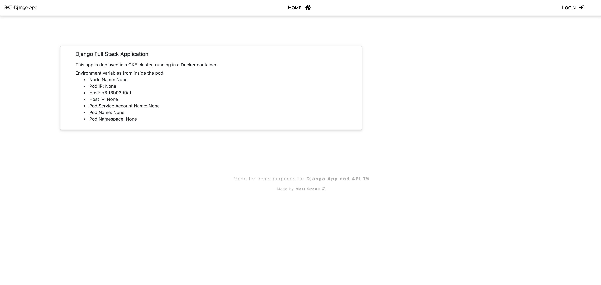
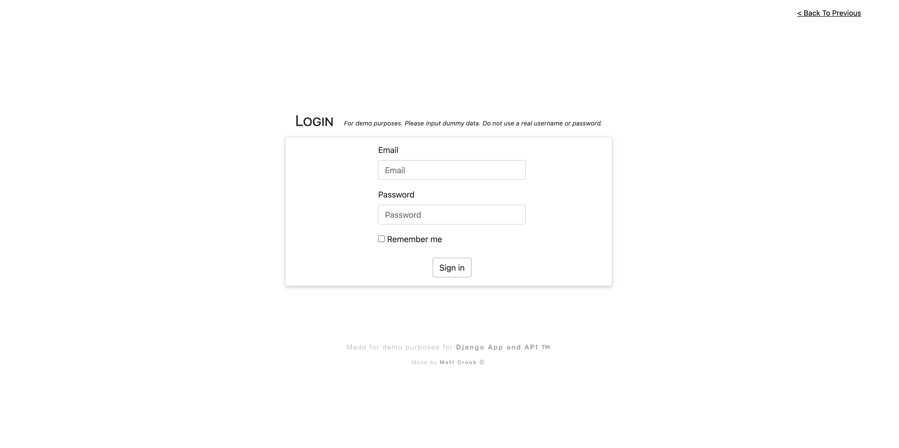

# Django Full Stack App

Basic Django full stack application.


---



## Setup

Run the following Make targets if you wish to run the app either locally, or using Docker.

#### Running Locally

```
make prep
make init_db
make run_local
```

The app will be available on `http://localhost:8000`

#### Running with Docker (preferred)

To run app using Docker:

```
make run_docker
```

Or, just for fun and as a added bonus, can also run with docker compose:
```
make run_docker_compose_up
```

With the image built and the container running, the app should now be available on `http://localhost:8000`

You can also exec into the container, if you need to debug anything by running:

```
make docker_exec CONTAINER_ID=<CONTAINER_ID>
```
* Where `CONTAINER_ID` is the ID of the running container you would like to exec into.


## Provisioning infrastructure and deploying app with Kubernetes or Helm

The app can be run on any infrastructure you choose (single compute instance, instance group, GKE cluster etc...) but for this example, it is meant to run in a GKE cluster.

***To see instructions on provisioning the infrastructure, see the ReadMe for the child module cluster [here](/gke/live/dev/cluster/).***

***To see instructions on deploying with Kubernetes or Helm, see the ReadMe [here](/gke/live/dev/app/).***


| Note: This is pulling a private Docker repository image. Either change the image in the `.yaml` file to one of yours, and deploy a docker registry secret, or change the image to a public image. |
| ----------------------------------------------------------------------------------------------------------------------------------------------------------------------------------------------------------------------- |

* Public image for this app is `mgcrook11/gke-django-app-public:1.0`
* Change the `.spec.containers.image` to this, as well as port (to 8000) and get rid of `imagePullSecrets`

#### Tearing Down

Don't forget to clean up your infrastructure once finished.

If created cluster with glcoud, run:
```
gcloud container clusters delete <CLUSTER_NAME>
```

If created with Terraform, run:
```
terraform destroy
```
