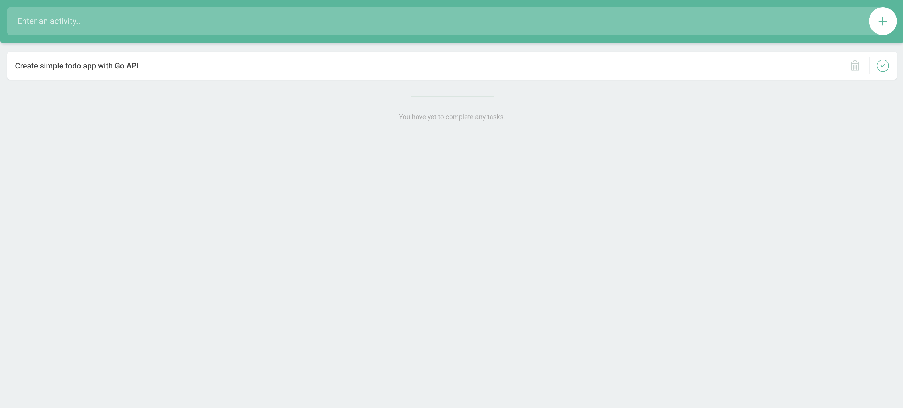

# Go ToDo App

Super simple todo app, featuring full CRUD operations. Features a Go API as the backend, and a very simple frontend (client) you can access via either just the file in the browser, or (my preference) using [http-server](https://www.npmjs.com/package/http-server).





## Running API and Client
##### Running MySQL Database

This is for demonstration purposes, but to locally run a MySQL database instance with Docker, run the following commands:
```
docker run -d -p 3306:3306 --name mysql -e MYSQL_ROOT_PASSWORD=root mysql

docker exec -it mysql mysql -uroot -proot -e 'CREATE DATABASE todolist'


Login to MySQL from terminal:
- mysql --host=127.0.0.1 --port=3307 -u root
```

#### Running Go API
```
- go mod tidy

Run Go program:
- go run todolist.go

Or to compile and create binary executable:
- go build todolist.go
- ./todolist.go
```


#### Run client App to Access UI:
```
Can go to file:
- file://Users/path/to/index.html


Or, with http-server (cool tool!):
cd to client directory

-  npx http-server
```


##### Run whole thing with docker-compose:

```
docker-compose up --build
```


##### Packages
```
https://betterprogramming.pub/build-a-simple-todolist-app-in-golang-82297ec25c7d
go get -u github.com/gorilla/mux
go get -u github.com/sirupsen/logrus
go get -u github.com/jinzhu/gorm
go get -u github.com/go-sql-driver/mysql
go get -u github.com/jinzhu/gorm/dialects/mysql
go get -u github.com/rs/cors
go mod init
go mod tidy
```

###### Notes
https://github.com/olliefr/docker-gs-ping/blob/main/Dockerfile
https://docs.docker.com/language/golang/build-images/
